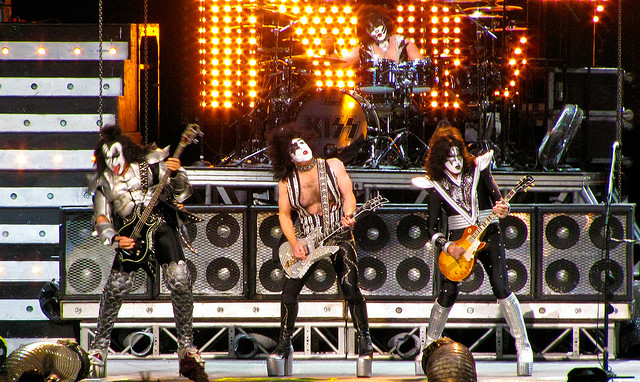
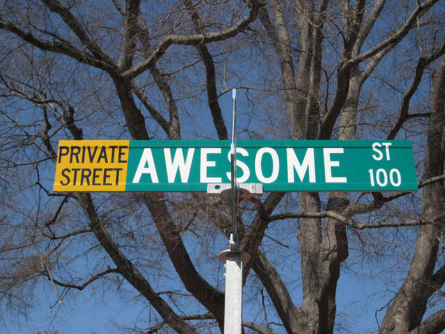

!SLIDE center background-image

# Mountable Apps #
## Stefan Sprenger ##

!SLIDE full-page
# Intro (blahblah)#

### [@flipping\_bits](http://twitter.com/flipping_bits)
### [http://github.com/flippingbits](http://github.com/flippingbits)
### [http://flippingbits.org](http://flippingbits.org)
### [http://dkd.de](http://dkd.de)

!SLIDE full-page new-chapter

# What's a Mountable App™?

!SLIDE full-page

# It's a Rails app in a Rails app.

!SLIDE full-page

# INCEPTION MEME PLACEHOLDER!

!SLIDE full-page center-fixed-top

# Elegancy

!SLIDE full-page center-fixed-top

# Kick-Ass Rock Star

!SLIDE full-page center-fixed-top

# Awesomeness <3

!SLIDE full-page new-chapter

# Core Features

!SLIDE full-page

# Just a Rails app

!SLIDE full-page

# Packaged as a gem

!SLIDE full-page

# Isolated namespace

!SLIDE full-page

# Rails generators

!SLIDE full-page

# Asset pipeline

!SLIDE full-page

# 100% testable