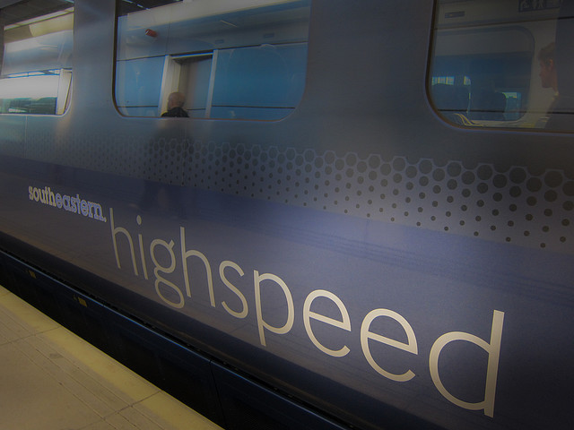

!SLIDE front

# Mountable Apps

!SLIDE
# Intro (blahblah)#

### [@flipping\_bits](http://twitter.com/flipping_bits)
### [http://github.com/flippingbits](http://github.com/flippingbits)
### [http://flippingbits.org](http://flippingbits.org)
### [http://dkd.de](http://dkd.de)

!SLIDE new-chapter

# Don't repeat yourself.

!SLIDE new-chapter

# Don't repeat code.

!SLIDE new-chapter

# Don't repeat features.

!SLIDE new-chapter

# What's a Mountable App™?

!SLIDE

# It's a Rails app in a Rails app.

!SLIDE center-fixed-top

# Elegancy

!SLIDE center-fixed-top

# Powerful

!SLIDE center-fixed-top

# Less pain <3

!SLIDE new-chapter

# Core Features

!SLIDE

# Just a Rails app

!SLIDE

# Packaged as a gem

!SLIDE

# Isolated namespace

!SLIDE

# Rails generators

!SLIDE

# Asset pipeline

!SLIDE

# 100% testable