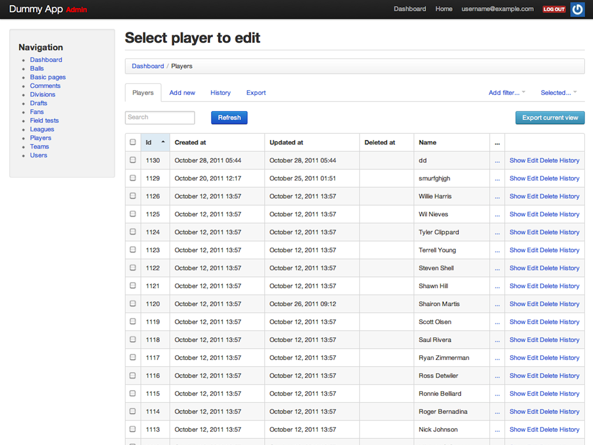

!SLIDE new-chapter

# Mounting the app

!SLIDE center

# Add the dependency to Gemfile

    @@@ruby
    gem "simple_blog", :path => "~/Codes/simple_blog"

!SLIDE center

# Install migrations

    $ rake simple_blog:install:migrations
    $ rake db:migrate

!SLIDE center

# Add routes

    @@@ruby
    Railscamp::Application.routes.draw do
      mount SimpleBlog::Engine => "/blog"
    end

!SLIDE

# Restart server

!SLIDE

# GET [http://localhost:3000/blog](http://localhost:3000/blog)

!SLIDE

# Enjoy!

!SLIDE new-chapter

# Real-life examples

!SLIDE

# Forem
## [https://github.com/radar/forem](https://github.com/radar/forem)

!SLIDE

# Rails Admin
## [https://github.com/sferik/rails_admin](https://github.com/sferik/rails_admin)

!SLIDE center

